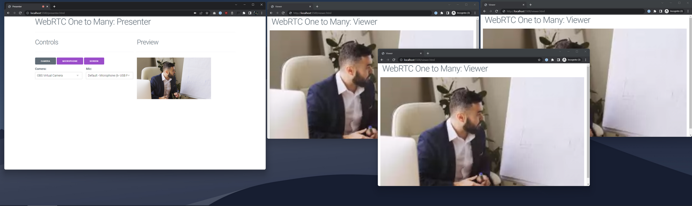

# WebRTC Live Streaming Demo

## Powered by [Metered Real Time Live Streaming](https://www.metered.ca/live-streaming)

## Overview

This application contains sample code for live streaming with WebRTC. You can live stream to thousands of viewers in real-time with Ultra-low Latency.

## Guide

To learn how this application is developed, read the detailed step by step guide here: https://www.metered.ca/blog/webrtc-live-video-streaming/

## Project Structure

The `presenter.html` contains the code for the presenter, that will broadcast his/her camera/screen + microphone to the viewers.

The `viewer.html` contains the code for the viewer, the the viewer will play the live stream for the presenter in real-time in ultra low latency.

## Setup Requirements

Before you use this application, you would have to create Room, and obtain the Room URL. To get a room URL:

- Signup for a free account from https://www.metered.ca -> **Signup and Start Building**
- Then go to **dashboard**->**Create Room** and create the room
- Your Room URL is `"<name-of-your-app>.metered.live/<name-of-your-room>"`

## Further Reading

You can checkout [Metered Blog](https://www.metered.ca/blog) and [Metered Docs](https://www.metered.ca/docs).
